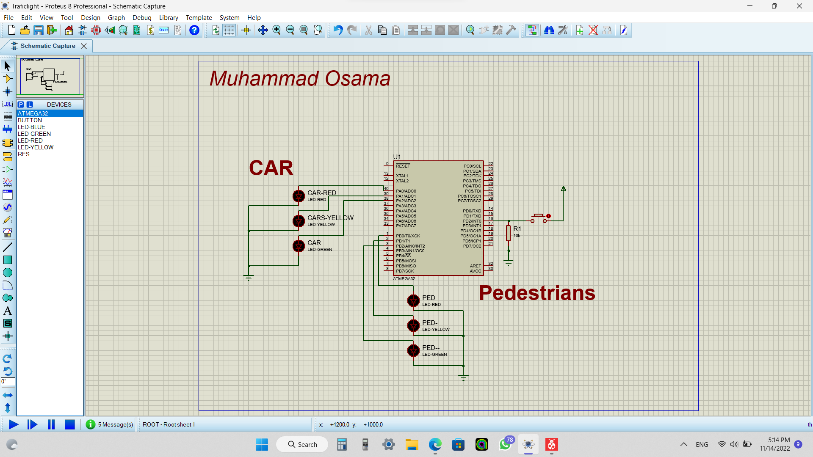

# OnDemand Traffic Light system Project 
## Description
> Embedded Systems project using ATMEGA-32 used to Control LED and Push Button as input device with Some unique Constrains and Cross Button  for Pedestrians 

## ***System Constrains***
When a pedestrian presses the Cross way Button for double pressed the first  press they will activate pedestrian mode and the second do nothing 
If the pedestrians press the button for long time,  nothing will be happened  

## ***Project Componnent***
* ATMEGA-32
* Push Button
* LED
## ***Project FlowChart***

## ***Project Schematic***

